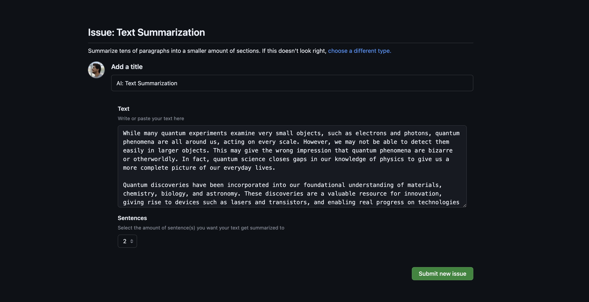

This page contains the features and implementations that you can have within your Python actions.

## Action Inputs & Outputs
Action inputs and outputs must be defined inside the `your-action/action.yml` file first. The following example shows that our action only receives an input variable named `endpoint`.

```yaml title="your-action/action.yml"
inputs:
  endpoint:
    description: 'API Endpoint URL'
    required: true
```

In a workflow, you may want your action to accept some data to work on. It can be done using the `pyaction.io.read()` function. It takes the variable name and looks inside the environment to find the corresponding value.

In the following job step showcase, we're sending an API endpoint URL to our action and receiving it from that other side.

```yaml title=".github/workflows/ci.yml"
steps:
  - name: Requesting
    uses: you/your-action
    with:
      endpoint: somewhere.com/api/endpoint
```

```py title="your-action/main.py"
from pyaction import io

def main():
  url = io.read("endpoint")
  # url = "somewhere.com/api/endpoint"
```

Writing a value into the workflow is as easy as reading it. Use the `pyaction.io.write()` function to write as many variables as you want and access them within the workflow. Don't forget to define the output variables inside your `action.yml` file.

```yaml title="your-action/action.yml"
outputs:
  first_name:
    description: 'First Name'
  last_name:
    description: 'Last Name'
  age:
    description: 'Age'
```

```py title="your-action/main.py"
from pyaction import io

def main():
  io.write(
    {
      "first_name": "John",
      "last_name": "Doe",
      "age": 20,
    }
  )
```

```yaml title=".github/workflows/ci.yml"
steps:
  - name: Providing variables
    id: provider
    uses: you/your-action

  - name: Echoing variables
    run: |
      echo ${{ steps.provider.outputs.first_name }}
      echo ${{ steps.provider.outputs.last_name }}
      echo ${{ steps.provider.outputs.age }}
```

In general, it would take three major steps to implement IO interactions inside actions.

- Defining the inputs/outputs inside the `action.yml` file.
- Using `pyaction.io` to read/write the variable(s).
- Sending/receiving the parameters within the workflow.

## IssueForm
Issue form templates allow developers to create specific structures for those who want to open issues on their repositories. As GitHub says, you can define different input types, validations, default assignees, and default labels for your issue forms. This capability makes it easier to use Issue Forms as the UI side of your services with the help of GitHub Actions.

In PyAction, you are able to parse the issues that are created with issue forms and use the data inside them.

### Creating an issue form

!!! Note "If you want to start using GitHub Issue Forms.."
    Check out this [official tutorial](https://docs.github.com/en/communities/using-templates-to-encourage-useful-issues-and-pull-requests/syntax-for-issue-forms) on how you can make issue forms, different types, and validations for your repository.

Consider the following issue form configuration. It contains two fields. A `textarea` named `Text` and a `dropdown` field that contains a few numeric values named `Sentences`.

```yaml title=".github/ISSUE_TEMPLATE/text_summarize.yml"
name: Text Summarization
description: Summarize tens of paragraphs into a smaller amount of sections
title: "AI: Text Summarization"
labels: ["summarization", "ai"]
body:
  - type: textarea
    attributes:
      label: Text
      description: Write or paste your text here
      render: markdown
    validations:
      required: true
  - type: dropdown
    id: sentences
    attributes:
      label: Sentences
      description: Select the amount of sentence(s) you want your text get summarized to
      options:
        - 2
        - 4
        - 6
        - 8
      default: 0
    validations:
      required: true
```

Head to the **"Issues"** tab of your repository. Try to create one and you'll see an issue template item called **"Text Summarization"**.

{.rounded}

Click **"Get started"** and you'll see an interface in the following form.

{.rounded}

Now, the point is that when you create the issue, you can have a job triggered to read this issue body and process it. In the next section, we'll see how you can read the issue in your action.

### Reading the issue inside the action

In order to retrieve the values set for the `Text` and `Sentences` fields, first we need to get the issue number. We should retrieve it inside the workflow, meaning we have to define an input parameter for this purpose.

```yaml title="your-action/action.yml" hl_lines="12-14"
inputs:
  github_token:
    description: The GitHub auth token
    default: ${{ github.token }}
    required: true

  repository:
    description: The repository name in the form of "<owner>/<repo>"
    default: ${{ github.repository }}
    required: true

  issue_number:
    description: The id of the issue
    required: true
```

We also need `github_token` and `repository` inputs to authenticate and interact with GitHub and get the issue data that we need. They both have a default value so *they don't need to be set inside the workflows*.

This is how we can get the issue number/ID and send it as an input parameter to an action within a workflow.

```yaml title=".github/workflows/ci.yml" hl_lines="11"
on:
  issues:
    types: [opened]

...

steps:
  - name: Running the action
    uses: you/your-action
    with:
      issue_number: ${{ github.event.issue.number }}
```

Now, to serialize the issue data coming from the workflow, we have to use `Auth` and `IssueForm` classes.

```py title="your-action/main.py"

from pyaction.auth import Auth
from pyaction.issues import IssueForm

from pyaction import io

...

def main():
    auth = Auth(token=io.read("github_token"))
    auth.authenticate()

    repo = auth.github.get_repo(io.read("repository"))
    user_input = IssueForm(repo=repo, number=int(io.read("issue_number"))).render()

    # user_input = {
    #   "Text": "While many quantum experiments examine very small..",
    #   "Sentences": "2"
    # }
```


## Publishing in the Marketplace
[GitHub Marketplace](https://github.com/marketplace) is a platform where tens of actions and GitHub Apps are being hosted and developed. You can also publish your own actions and third-party applications there too.

To do so, make sure that your action's slug is a unique phrase. Thus, we have to check the following URLs and make sure they all end up being 404 pages.

* `https://github.com/<action_slug>`
* `https://github.com/orgs/<action_slug>`
* `https://github.com/marketplace/actions/<action_slug>`

For the further steps, I suggest you follow the [official docs](https://docs.github.com/en/actions/creating-actions/publishing-actions-in-github-marketplace).
